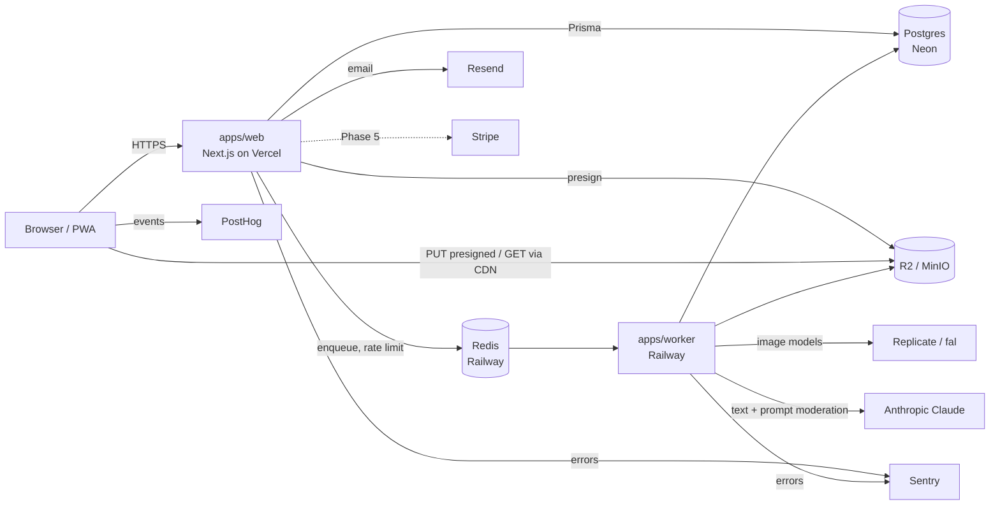
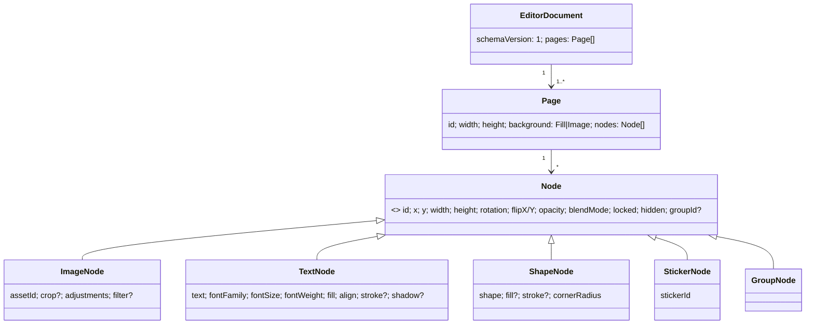
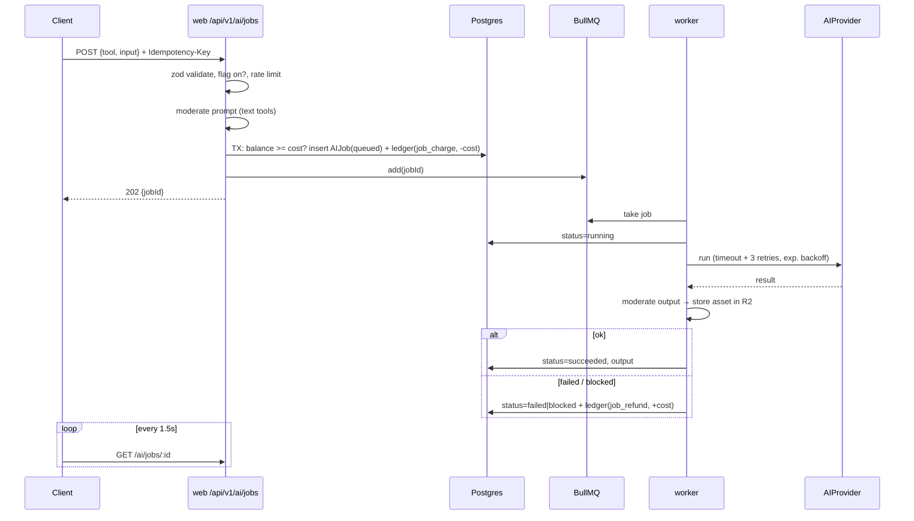
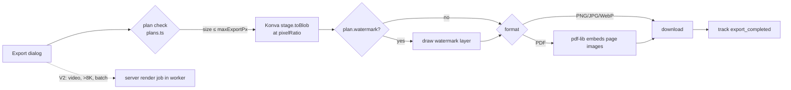

# Architecture

Stack choices and their reasons are in [ASSUMPTIONS.md](ASSUMPTIONS.md) (D1–D18). The ER diagram is in [DATA_MODEL.md](DATA_MODEL.md), endpoints are in [API_SPEC.yaml](API_SPEC.yaml), and threats are in [SECURITY.md](SECURITY.md).

All diagrams live in this one file rather than under `docs/architecture/`, because one file is easier to keep in sync.

## Repo layout

```
apps/
  web/            Next.js App Router — UI + REST API (/api/v1/* route handlers) + Better Auth (/api/auth/*)
  worker/         Node + BullMQ — AI jobs, upload processing/thumbnails, server exports   (created Phase 1)
packages/
  db/             Prisma schema, client, seed
  shared/         APP_NAME, plans/limits/credit costs, shared zod schemas & types
  editor-core/    Document model (zod), migrations, commands/history — pure TS, no DOM
  ai/             AIProvider interfaces + mock/replicate/anthropic adapters + moderation   (created Phase 4)
```

Dependency direction: `apps → packages`. `editor-core` and `shared` depend on nothing internal. `db` depends on both, because the seed uses them.

## 1. System context



The web app is stateless: sessions live in Postgres and rate-limit counters in Redis. Anything slower than about 2 s goes to the worker.

## 2. Editor document model

The source of truth is `packages/editor-core/src/document.ts` (zod). Its shape:



Rules:
- **Non-destructive.** Source pixels are never modified. Adjustments and filters are data that the renderer applies, so "before/after" just renders with effects off.
- **Flat layers.** `nodes[]` is in z-order (index 0 is the bottom). Groups use `groupId` instead of nesting, so reorder and undo stay simple array operations.
- **Versioned.** Every load goes through `migrate()`, which steps forward through `MIGRATIONS` and then validates. Bumping `CURRENT_SCHEMA_VERSION` requires a migration plus a test.
- **Undo/redo (Phase 2).** Each command is a pure function `(doc) → doc`, and history stores Immer patches (inverse + forward) rather than full snapshots. The cap is 100 steps.
- **Autosave (Phase 2).** Saves are debounced to 2 s and send `PATCH /projects/:id {document, revision}`. On a stale revision the server answers 409. The client then saves a copy and prompts the user, so no data is ever silently lost. Unsaved state is also mirrored to IndexedDB for crash recovery.

## 3. AI job lifecycle



- Credits are **charged up front and refunded on failure**, never charged after the work. A crash therefore can't produce free work, and `dedupeKey = charge:<jobId>` / `refund:<jobId>` makes retries safe.
- The balance check and the charge run in one transaction with `SELECT … FOR UPDATE` on the user row, so two parallel jobs can't overdraw.
- The `AIProvider` interfaces are split per capability (`removeBackground`, `textToImage`, `writeText`, `moderateText`), so an adapter implements only what it supports. The provider is picked by `AI_IMAGE_PROVIDER` / `AI_TEXT_PROVIDER`.

## 4. Export pipeline



For MVP, export happens on the client. The watermark can be bypassed, a known gap tracked as RISKS R6. Server-side rendering arrives with paid quality tiers and video.

## 5. Billing & credits (stub until Phase 5)

```mermaid
flowchart TB
  P[plans.ts: limits, credits, costs] --> E[entitlements(user) helper]
  S[Subscription.planId<br/>admin-set until Phase 5] --> E
  L[(CreditLedger<br/>append-only)] -->|SUM delta| B[balance]
  CRON[worker cron: 1st of month] -->|monthly_grant<br/>dedupe grant:YYYY-MM:user| L
  ADM[admin grant] -->|admin_grant + AuditLog| L
  JOB[AI job] -->|job_charge / job_refund| L
  E --> GATE[API gates: premium content, export size, AI tools]
  B --> GATE
  STRIPE[Phase 5: Stripe webhooks] -.->|set planId, purchase| S & L
```

Grants do not roll over. The monthly grant tops the user up to the plan amount rather than stacking, using `delta = max(0, plan.monthlyCredits - balance)`.

## 6. Auth & permissions

Better Auth handles email+password, Google OAuth, magic links and TOTP 2FA. Sessions are httpOnly cookies backed by the DB.

Every route handler begins with `const { user } = await requireSession(req, { role? })`. Data access always filters by a workspace the user is a member of, which prevents IDOR.

| Action | anon | user (own workspace) | viewer* | editor* | owner* | admin |
|---|---|---|---|---|---|---|
| Browse templates / tool pages | ✓ | ✓ | | | | ✓ |
| CRUD own projects / assets / folders | | ✓ | read | ✓ | ✓ | ✓ |
| Run AI tools (credits) | | ✓ | | ✓ | ✓ | ✓ |
| Use premium template / export > free size | | plan-gated | | plan-gated | plan-gated | ✓ |
| Manage workspace members | | | | | ✓ | ✓ |
| Admin: users, credits, flags, templates, reports | | | | | | ✓ |

\* Workspace roles only matter once Teams arrive in Phase 9. In MVP every user is the owner of a personal workspace.

## 7. Cross-cutting
- **Validation:** zod on every handler input, and the API types come from the same schemas in `packages/shared`.
- **Errors:** one shape, `{error:{code,message,details}}`. The handler wrapper maps `ZodError` to 400, auth failures to 401/403, insufficient credits to 402 and rate limits to 429.
- **Rate limits:** a Redis sliding window per user and per IP. AI endpoints get tighter limits.
- **Observability:** pino JSON logs with a `requestId`, plus Sentry on both web and worker. The worker logs `jobId`, provider, latency and cost.
- **Feature flags:** `isEnabled(key, user)` reads the `FeatureFlag` table, cached in memory for 30 s.
