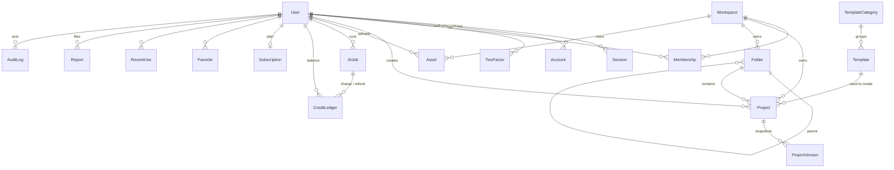

# Data Model

**Source of truth: [`packages/db/prisma/schema.prisma`](../packages/db/prisma/schema.prisma).** It holds the MVP models (Phases 1–4 plus the billing stub). Models planned for later phases are listed below and get added in their own phase, so we don't carry unused tables.

## ER diagram (MVP)

`Font`, `FeatureFlag` and `Verification` are standalone tables.

## Key decisions

| Decision | Reason |
|---|---|
| `Project.document` is JSONB, validated by `editor-core` `migrate()` on every write | The document is read and written as a whole and never queried by field. Normalizing layers into tables would only add joins |
| `Project.revision` counter | Autosave uses optimistic concurrency, and a stale write gets a 409 rather than a silent overwrite |
| A personal `Workspace` is auto-created at signup, and projects and assets belong to workspaces | Teams in Phase 9 then needs no data migration |
| `CreditLedger` is append-only and the balance is `SUM(delta)` | Fully auditable, and the `dedupeKey` unique index makes grants, charges and refunds idempotent. Add a cached balance column if `SUM` shows up in profiles |
| `AIJob` doubles as prompt history | One table instead of two. Favorites use `Favorite(targetType='ai_job')` |
| `Favorite` and `RecentUse` are polymorphic (`targetType`, `targetId`) | Tiny tables with no FK fan-out. Stale targets are filtered out at read time |
| Asset thumbnails live in a `variants` JSON column rather than an `AssetVariant` table | Variants are always read with their asset and never on their own |
| No `AIPrompt`, `AssetVariant` or `Sticker` tables | `AIPrompt` is replaced by `AIJob`, `AssetVariant` by `Asset.variants`, and stickers are `Asset(kind=sticker)` |
| Soft delete on `User` (with a hard purge after 30 days) and on `Project` (trash) | Gives a GDPR grace period and lets users undo a delete |
| Template search uses a generated `tsvector` column with a GIN index, added by a raw SQL migration in Phase 3 | Postgres full-text search before reaching for Meilisearch (D9) |

## Planned models (added in their phase)

| Phase | Models |
|---|---|
| 5 Billing | `Invoice` (mirror of Stripe), Stripe columns already exist on `Subscription` |
| 6 V2 editing | `BrandKit` (workspaceId, colors[], fonts[], logoAssetIds[]) |
| 8 Community | `Post`, `Comment`, `Like`, `Follow`, `Notification`, `Hashtag`/`PostHashtag`. `Report` already exists |
| 9 Teams | `Invite`, `ShareLink` (projectId, role, token, expiresAt), `DesignComment` |
| 10 Platform | `ApiKey` (hashed key, workspaceId, scopes, quota), `ApiUsage` |

## Migrations & seed
- `pnpm db:up && pnpm db:migrate` creates and applies migrations (`prisma migrate dev`).
- `pnpm db:seed` is idempotent. It creates an admin user (with no password; sign in with a magic link in dev), template categories, fonts, feature flags and one sample template.
- Production runs `prisma migrate deploy` in the deploy pipeline. Migrations follow an expand-then-contract pattern: no drops in the same release that stops using a column.
