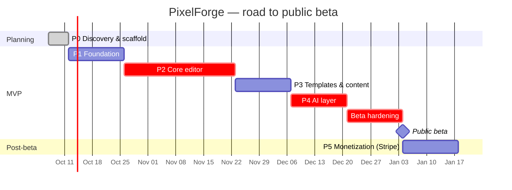

# Roadmap

Solo developer + Claude, ~12 weeks from kickoff (week 0 = 2026-10-07) to public beta. The MVP is Phases 1–4 (lean cut). Billing (Phase 5) follows the beta. Estimates are ideal working weeks with ~15% buffer built into the beta-hardening block.

## Timeline

## Milestones & exit criteria

| Milestone | Weeks | Scope | Exit criteria |
|---|---|---|---|
| **M0 — Plan approved** | 0 | All Phase 0 docs, monorepo scaffold, CI, docker-compose, seed | `pnpm lint typecheck test` green locally and in CI; `docker compose up` + seed works; user approves the docs |
| **M1 — Foundation** | 1–2 | Better Auth (email, Google, reset, verify), profile/settings, migrations, presigned upload → worker MIME check + thumbnails, My Uploads, app shell, design tokens + shadcn, feature flags, admin skeleton (RBAC + AuditLog), i18n + theme + PWA shell, Playwright set up | E2E: sign up → upload → see thumbnail passes; non-admin gets 403 on /admin; Lighthouse PWA installable |
| **M2 — Editor MVP** | 3–6 | Document model + migrations, Konva canvas, text/shape/image/sticker, transforms, layers basic, undo/redo, autosave + crash recovery, crop/resize, adjustments, filters, compare, export PNG/JPG/WebP/PDF + watermark, My Designs, folders, shortcuts | 60 fps with 200 objects (perf test); editor interactive < 3 s; E2E create → edit → export passes; ≥ 70% coverage on `editor-core` |
| **M3 — Templates & content** | 7–8 | Template admin publish, browser + FTS search + filters, use-template, stock photos (Unsplash/Pexels), stickers, fonts + custom upload, favorites/recents, collage grid, global search | Search p95 < 500 ms on seed data of 1k templates; use-template E2E passes; attribution stored on every stock asset |
| **M4 — AI layer** | 9–10 | `AIProvider` + mock + Replicate + Anthropic adapters, BullMQ jobs, credit ledger (reserve/capture/refund), gating, rate limits, moderation, BG remover, image gen, AI writer, prompt history, job progress polling | Ledger invariants unit-tested; refund on provider failure verified; moderation blocks a seeded unsafe prompt; per-job cost logged |
| **M5 — Public beta** | 11–12 | Perf pass, a11y audit (axe + manual keyboard/screen reader), security review (SECURITY.md checklist), legal pages + cookie consent, SEO tool landing pages, Sentry + PostHog live, prod deploy (Vercel/Railway/Neon/R2), backup + restore drill | Zero critical/high a11y and security findings open; restore drill succeeds; activation funnel visible in PostHog |
| **M6 — Monetization** | 13–14 (post-beta) | Stripe Checkout + Billing + webhooks + Customer Portal, entitlement source switched from admin to Stripe, credit bundles, pricing page, receipts | Webhook replay is idempotent; test-mode upgrade → watermark removed → downgrade → watermark returns |

Phases 6–11 are re-planned after the beta, using real usage data.

## Critical path

`document model (editor-core)` → `canvas + transforms` → `autosave` → `export` → `templates (need a stable doc schema)` → `AI results land as layers` → `beta hardening`.

The editor-core document schema is the single biggest dependency: templates, AI results, export and (later) collaboration all serialize through it. It gets a versioned Zod schema + migrations in week 3 and should not change shape without a migration afterwards.

Off the critical path (can slip without moving the beta): collage maker, custom font upload, magic link/2FA, PWA polish, prompt history.

## Scope guardrails (solo dev)
- Each phase ends with a demo + approval gate. Anything new goes to `docs/BACKLOG.md`, never into the current phase.
- If a phase overruns by more than 3 days, cut "Could" items from the PRD MoSCoW table first, then "Should".
- Fallback for a slipped beta: ship without the collage maker and custom fonts, and keep the AI writer (cheap) before the image generator (expensive, moderation-heavy).

## Top risks (full register: [RISKS.md](RISKS.md))
| ID | Risk | Mitigation in plan |
|---|---|---|
| R1 | IP/legal: copied assets or unlicensed stock | Only own/CC0/API-licensed content; attribution fields from M1 |
| R3 | AI cost runaway | Credit pre-check + reserve, rate limits, per-job cost logging, provider spend caps (M4) |
| R5 | Unsafe content (NSFW/CSAM) | Prompt + output moderation in M4; hash matching required before any public sharing (Phase 8) |
| R7 | Canvas performance | 200-object perf test as an M2 exit criterion |
| R9 | Solo scope creep | Phase gates, BACKLOG.md, MoSCoW cut order above |
| R11 | Data loss | Autosave + IndexedDB crash recovery as an M2 exit criterion; DB backup drill in M5 |
